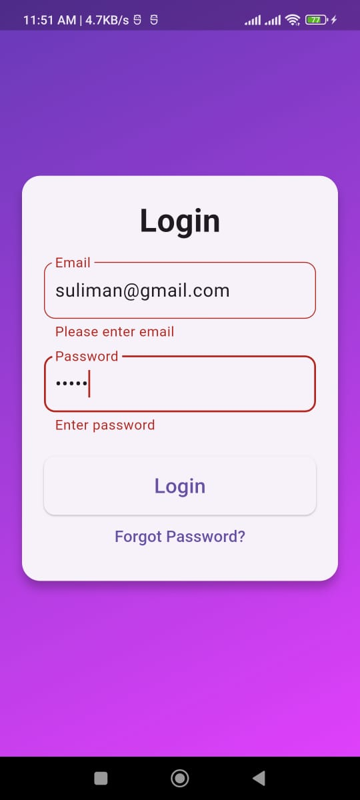

# Flutter Internship Tasks - Login Page

This is a simple **Flutter Login Page project** created as part of my internship tasks.

## Features
- Email and Password input fields
- Basic UI with validation
- Navigation from Login Page to Home Screen
- Flutter form usage
## Screenshots

Login Page:  

Home Screen:  

## How to Run
1. Clone this repository:
   git clone https://github.com/sulimankhan643/flutter_internship_tasks.git
